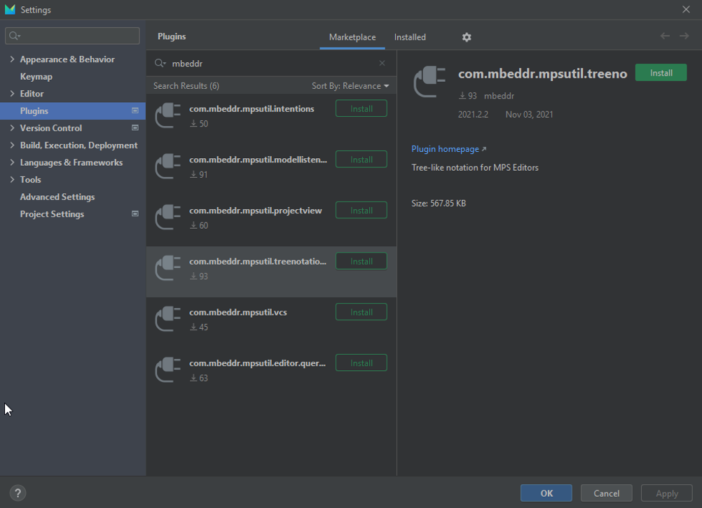
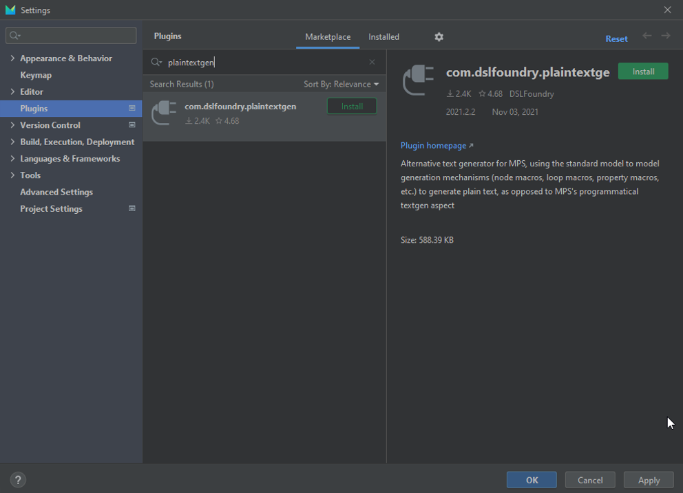
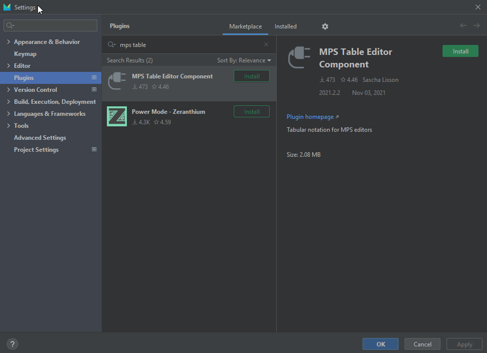

## Installation Guide

1.	Download and install [MPS version 2021.2](https://www.jetbrains.com/mps/download/#section=windows)

2.	Download or clone the project from [GitHub repository](https://github.com/SOM-Research/selfadaptive-IoT-DSL.git)

3.	Open MPS, and then open the DSL project by selecting the folder

4.	Some plugins must be installed. Select `File -> Settings -> Plugins` and install the following plugins:

	> _Note: Some of these plugins require additional plugins that MPS will suggest you install (if this happens, simply select install). For example, the com.dslfoundry.plaintext plugin will require the Mouse Selection Support plugin._

	a.	com.mbeddr.mpsutil.treenotation

	

	b.	com.dslfoundry.plaintext

	

	c.	MPS Table Editor Component

	

5.	Restart MPS and you will now be able to use the DSL to model IoT systems.