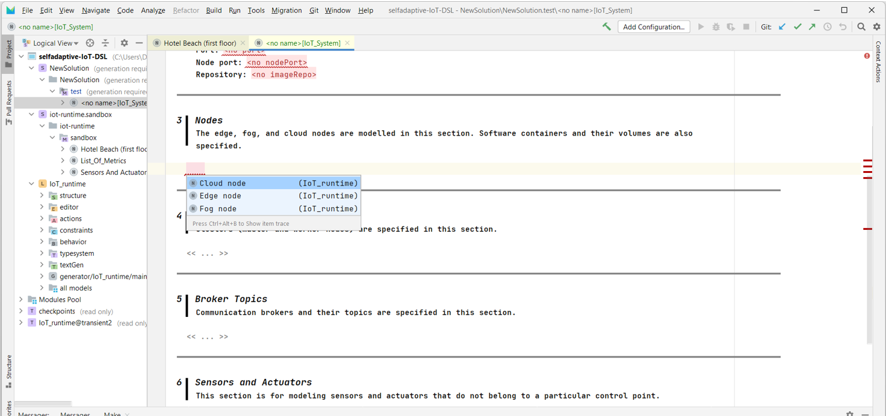

## Quick Start Guide

1.	Download or clone the project from [GitHub repository](https://github.com/SOM-Research/selfadaptive-IoT-DSL.git) and open it using MPS.

2.	In the left pane (Logical View) you find an example of a modeled IoT system (Hotel Beach first floor). You can open this example model by double clicking and explore the concepts modeled for an IoT system. The DSL has three notations (textual, tabular, and tree) to model the IoT system concepts. The notations for each concept are shown below.

3.	Three concepts (Nodes, Containers, and IoT Devices) can be modeled using two different notations (tabular and textual). The user is free to choose the notation. To change notation, right-click anywhere in the model workspace and select `Push Editor Hints`.

4. Select `Use custom hints` and then check `Use tabular notation` option.

5. Now, you can see the model in tabular notation for the nodes, their software containers, and the IoT devices.

# Create New Model

1. You can create new solution by right clicking on `selfadaptive-IoT-DSL -> New -> Solution`

2. Then, create a new model by right clicking on your `NewSolution -> New -> Model`

3. When you are creating a model, you have add **IoT_runtime** to `Used Languages`.

4. Finally, you can create a new IoT System model.

> _Note: You will need to create two other templates: (1) `Sensors And Actuators Type` to define the list of sensors and actuators types, and (2) `List_Of_Metrics` to define the list of QoS and infrastructure metrics that you will be able to relate in the adaptation rules. You can explore these two models in our sandbox model._

# IoT System Modeling

1. When you create a new model, you get a template for specifying the IoT system.

2. To model any aspect of the IoT system, just press the *Enter* key in the corresponding section and you will get a template with the attributes to be specified. For example, to model an application, press *Enter* in the *Applications* section, you will get the model portion as shown below.

3. Some fields can be supported with the MPS autocomplete function. For example, when creating a new node, it is necessary to select the node type. To do this, press the *Enter* key in the *Nodes* section, and then the auto-complete function (by pressing `Ctrl+space` on windows or `Cmd+space` on MacOS). This will allow you to select one of the three types of nodes.

4. You can use the autocomplete function on any of the fields or attributes of a concept. In the example of the following image, we have defined two subregions. Then, when modeling the region of an Edge node, we can use the autocomplete function to quickly select one of the subregions we defined earlier.

# Code Generation

1. To generate the code once the IoT system model is finished, right click on the model and select `Rebuild Model 'solution.model'`.

2. If the model contains no errors, the generated code can be viewed in the directory `<<project_directory>>/solutions/<<solution_name>>/source_gen/<<solution_name>>/<<model_name>>`. The folders and generated code should look like this:

